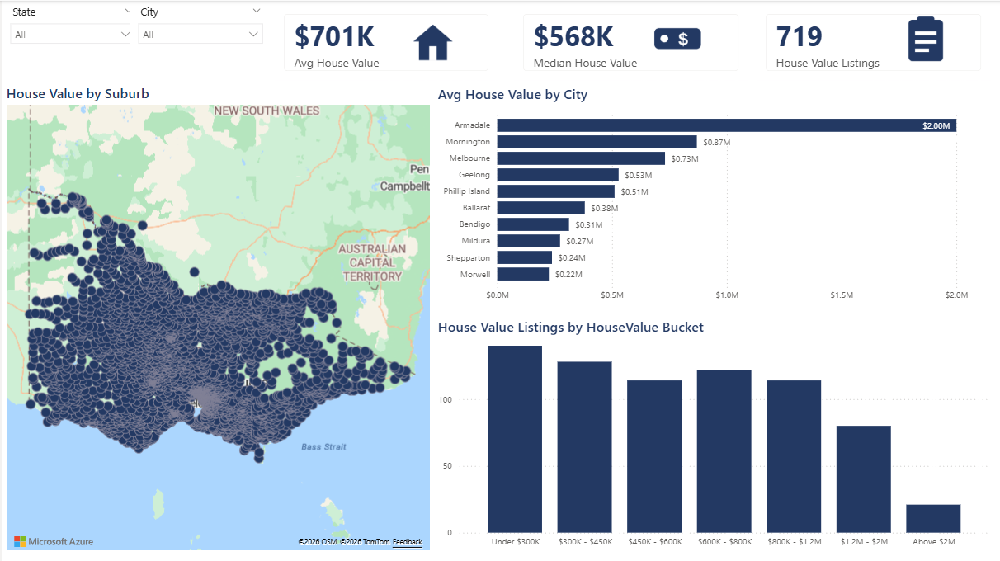
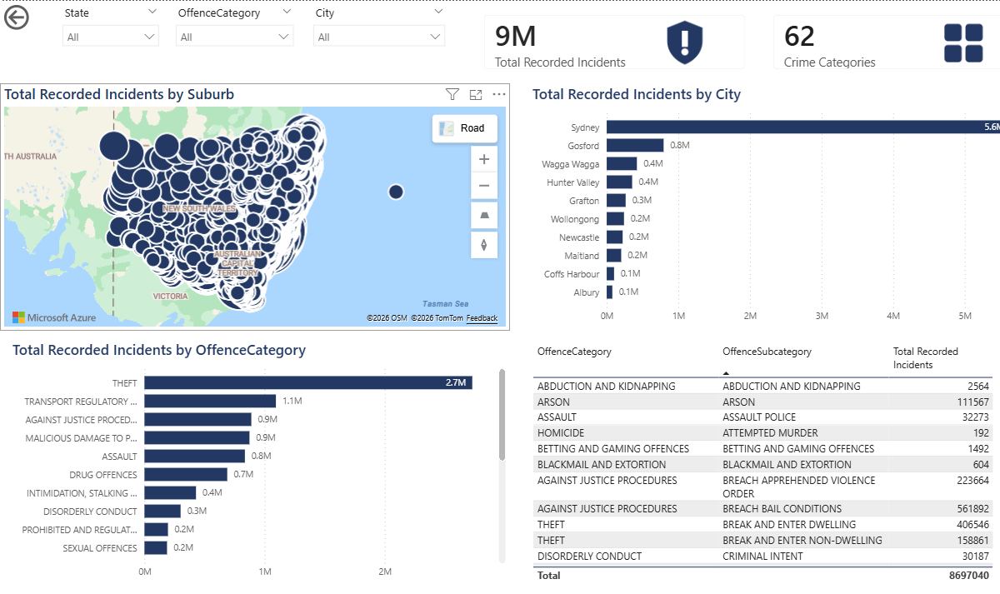
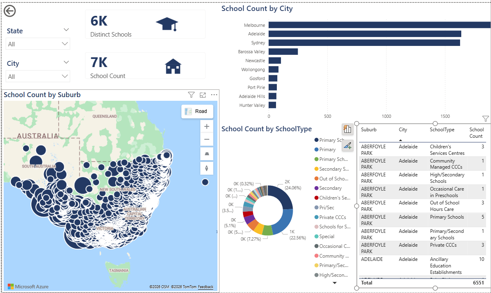
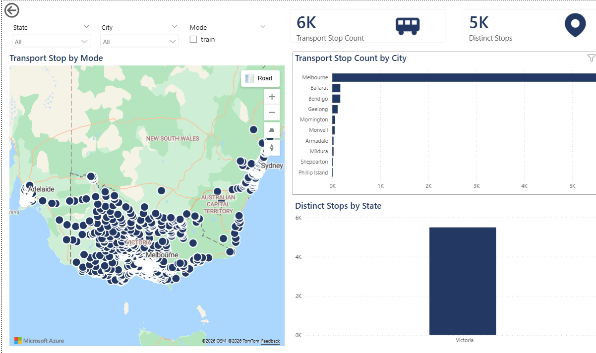

# Task 8 — Power BI on an Existing Data Warehouse

Built a Power BI dashboard connecting directly to a pre-existing data warehouse, covering data connection setup, modeling, and visualization. Five report pages: Home, House Value, Rental Value, Transport, and Crime — each with map, KPI cards, and breakdown charts, filterable by State/City/Suburb.

<table>
<tr>
<td width="50%"> House Value</td>
<td width="50%"> Crime Summary</td>
</tr>
<tr>
<td width="50%"> School Count</td>
<td width="50%"> Transport Stops</td>
</tr>
</table>

**Contents:**
- `BI Advanced - PowerBI - Existing Datawarehouse.docx` — task brief
- `AUProperty_DataConnectionDocumentation.docx` / `.pdf` — how the report connects to the warehouse
- `AUProperty_DashboardInsightsSummary.docx` / `.pdf` — key insights from the dashboard
- `AUProperty_ScreenshotDocumentation.docx` / `.pdf` — full dashboard screenshots
- `AUProperty_PowerBI_Dashboard.pbix` — the Power BI report file
- `AUProperty_Theme.json` — custom Power BI report theme
- `Icons/` — custom icon set used for dashboard KPI cards

**Raw data:** see [`../shared-data/AUS_Property_RawDataSet`](../shared-data/AUS_Property_RawDataSet).
