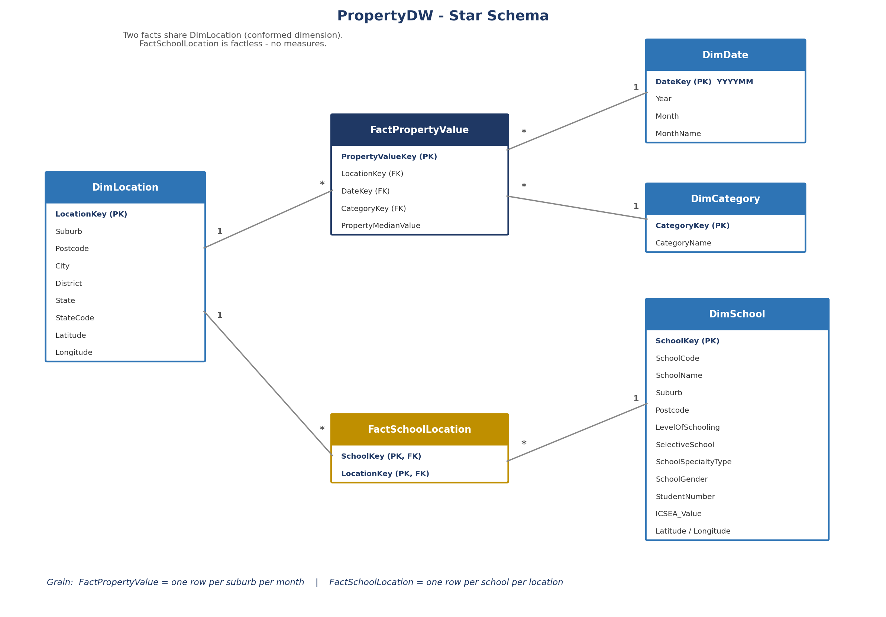

# BI Competition — Data Warehouse Modeling & Creation

Entry for the internship's BI Developer competition (Part 1): dimensional modeling exercise producing a bus matrix, schema diagram, design-decision writeup, and SSIS ETL packages.

**Contents:**
- `Task Description.docx` — competition brief
- `Phase3_Dimensional_Model.docx`, `PropertySprint_ETL_Writeup.docx` — modeling writeups
- `01_PropertyDW_Setup.sql` — warehouse setup SQL
- `docs/` — submission docs: SQL scripts, bus matrix, schema diagram, design decisions
- `PropertySprint_ETL/` — SSIS packages (staging load, star-schema load)

**Raw data:** see [`../shared-data/Competition_RawDataSet`](../shared-data/Competition_RawDataSet) (also used by project 09).
