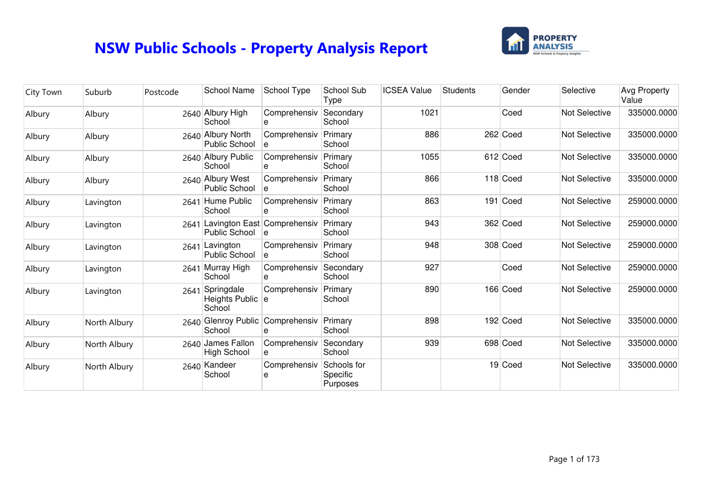

# BI Competition — Power BI Dashboard

Entry for the internship's BI Developer competition (Part 2): a Power BI dashboard and SSRS report built on the warehouse from the modeling round, plus bonus SQL/DAX practice exercises.

**Contents:**
- `Property Analysis BI Developer Competition Tasks Instruction - Part 2.pdf` — competition brief
- `BI Competition - PowerBI Dashboard Word Doc.docx` — writeup
- `Bus_Matrix.xlsx`, `Design_Decisions.docx`, `Schema_Diagram.png` — modeling artifacts
- `01_Create_Staging_Tables.sql`, `02_Create_Dimension_Tables.sql`, `03_Create_Fact_Tables.sql` — warehouse build SQL
- `PropertyAnalysis_Part2.pbix` — the Power BI dashboard
- `PropertyAnalysis_SSRS/` — SSRS project (`SchoolDetailsReport.rdl`)
- `sample-output/` — a rendered copy of the school details report (PDF + Excel export, shown above)
- `PropertyAnalysis_Logo.png`, `PropertyAnalysis_Logo_white.png` — dashboard branding
- `Practice Exercises/` — bonus SQL window-function and DAX practice exercises with sample source data

**Raw data:** see [`../shared-data/Competition_RawDataSet`](../shared-data/Competition_RawDataSet).
